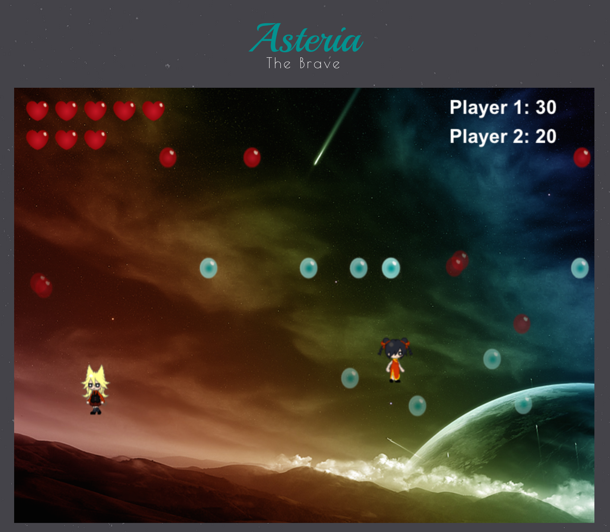

## README

Welcome to Asteria!

Asteria is a one or two-player game written in javascript using [Phaser](http://phaser.io) with a rails backend.

## How to Play

The goal is for Asteria and her friend to collect as many blue orbs as possible without falling or running into red orbs. 

Use the left and right arrow keys to jump in that direction. Land on top of an orb to continue jumping.

Each red orb you run into costs you one life. When you run out of life or if you fall the game is over.

## How to run the code

Clone the directory or download the zip folder and run 'bundle install'. Build the database by running 'rake db:create && rake db:migrate'. Run the game on a local server by using 'rails server'.

## Roadmap

Leaderboards and high scores are currently broken while the code is being re-written. Custom sprites are needed for the characters and two-player over web-sockets is coming soon.

## How to contribute

Submit a pull request with any contributions you'd like to make and we'll followup.
